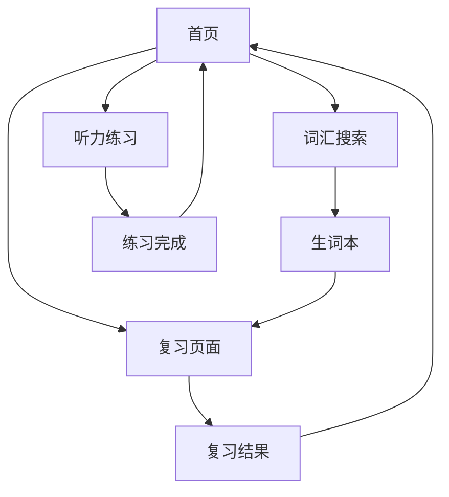

## 1. 产品概述
英语学习应用，帮助用户通过词汇搜索、科学复习和每日听力练习来提升英语水平。面向英语学习者，提供个性化学习路径和进度跟踪。

## 2. 核心功能

### 2.1 用户角色
| 角色 | 注册方式 | 核心权限 |
|------|----------|----------|
| 普通用户 | 邮箱/手机号注册 | 搜索词汇、添加生词本、复习词汇、听力练习、查看学习统计 |

### 2.2 功能模块
应用包含以下主要页面：
1. **首页**：学习概览、今日任务、学习统计
2. **词汇搜索页**：搜索框、搜索结果、添加到生词本
3. **生词本页**：词汇列表、复习状态、删除词汇
4. **复习页面**：今日复习词汇、复习进度、复习结果
5. **听力练习页**：音频播放器、字幕显示、练习题
6. **个人中心**：学习统计、设置、账号管理

### 2.3 页面详情
| 页面名称 | 模块名称 | 功能描述 |
|-----------|-------------|-------------|
| 首页 | 学习概览 | 显示今日学习进度、剩余复习词汇数量、连续打卡天数 |
| 首页 | 今日任务 | 展示今日听力练习和复习任务，点击进入对应页面 |
| 首页 | 学习统计 | 显示总词汇量、已掌握词汇、学习时长等数据 |
| 词汇搜索页 | 搜索框 | 输入中英文词汇进行搜索，支持模糊匹配 |
| 词汇搜索页 | 搜索结果 | 显示词汇的中文翻译、音标、词性、英文例句 |
| 词汇搜索页 | 添加到生词本 | 一键将搜索到的词汇加入个人生词本 |
| 生词本页 | 词汇列表 | 按添加时间倒序显示所有生词，显示复习状态 |
| 生词本页 | 复习状态 | 用颜色标识词汇掌握程度（新词/复习中/已掌握） |
| 生词本页 | 删除词汇 | 从生词本中移除已掌握的词汇 |
| 复习页面 | 今日复习词汇 | 根据艾宾浩斯曲线算法显示今日需要复习的词汇 |
| 复习页面 | 复习进度 | 显示当前复习进度和剩余词汇数量 |
| 复习页面 | 复习结果 | 记录用户对每个词汇的掌握情况，更新复习计划 |
| 听力练习页 | 音频播放器 | 播放5分钟BBC/TED音频，支持暂停、快进、重播 |
| 听力练习页 | 字幕显示 | 同步显示音频字幕，支持中英文字幕切换 |
| 听力练习页 | 练习题 | 根据音频内容提供理解练习题 |
| 个人中心 | 学习统计 | 详细展示学习数据图表和趋势分析 |
| 个人中心 | 设置 | 调整学习计划、提醒时间、难度等级 |
| 个人中心 | 账号管理 | 修改个人信息、密码、注销账号 |

## 3. 核心流程
用户注册登录后，首先进入首页查看今日学习任务。用户可以通过词汇搜索功能查找新词汇并添加到生词本。系统根据艾宾浩斯遗忘曲线自动安排复习计划，用户每日完成复习任务和听力练习。

## 4. 用户界面设计

### 4.1 设计风格
- 主色调：蓝色系（#1890ff）代表知识的海洋
- 辅助色：绿色（#52c41a）表示进步和成功
- 按钮样式：圆角矩形，悬停效果
- 字体：系统默认字体，标题16px，正文14px
- 布局风格：卡片式布局，清晰分隔各功能模块
- 图标风格：简约线性图标，易于理解

### 4.2 页面设计概览
| 页面名称 | 模块名称 | UI元素 |
|-----------|-------------|-------------|
| 首页 | 学习概览 | 顶部进度条显示今日完成度，卡片展示连续打卡天数和总词汇量 |
| 词汇搜索页 | 搜索框 | 顶部固定搜索栏，圆角设计，支持语音输入 |
| 词汇搜索页 | 搜索结果 | 卡片式展示，包含词汇、音标、翻译、例句，添加按钮醒目 |
| 生词本页 | 词汇列表 | 列表式布局，每个词汇显示掌握程度标识 |
| 复习页面 | 复习卡片 | 翻卡片式设计，正面显示英文，背面显示中文 |
| 听力练习页 | 音频播放器 | 底部固定播放器，进度条显示，字幕区域居中 |

### 4.3 响应式设计
采用桌面优先设计，适配平板和手机端。在移动设备上采用底部导航栏，优化触摸交互体验。

### 4.4 学习体验优化
- 使用渐进式色彩变化表示学习进度
- 添加微交互动画提升用户体验
- 采用清晰的视觉层次引导用户注意力
- 使用友好的图标和提示信息