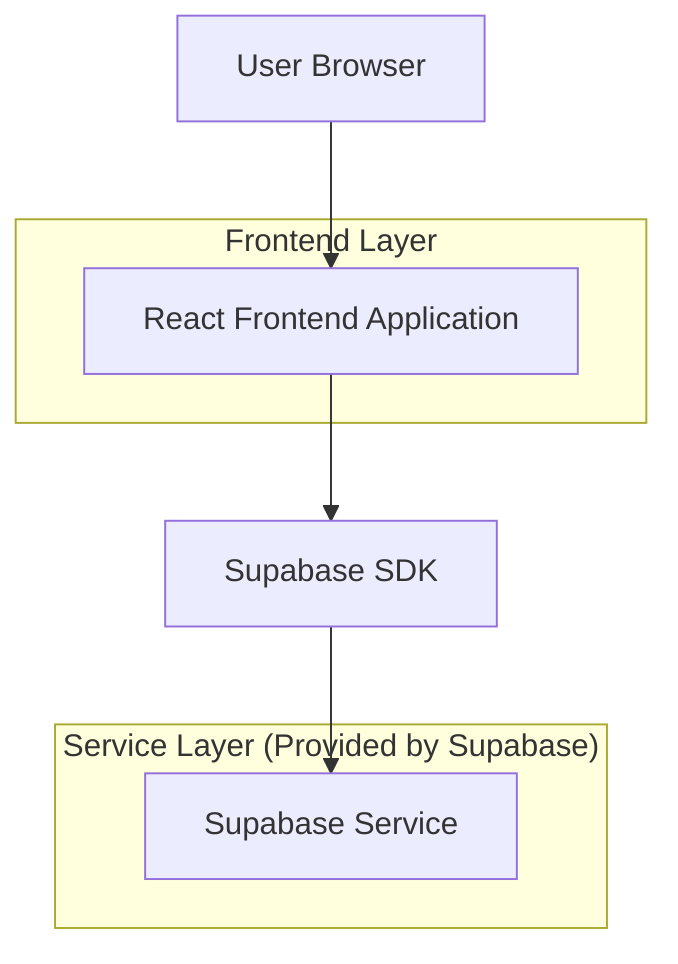
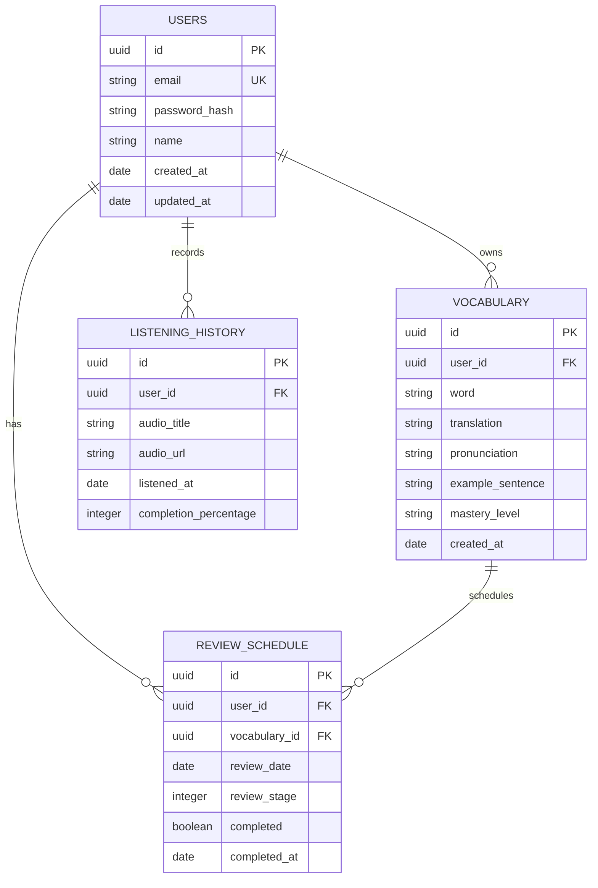

## 1. 架构设计



## 2. 技术描述
- 前端：React@18 + tailwindcss@3 + vite
- 初始化工具：vite-init
- 后端：Supabase (内置认证、数据库、存储)
- 音频处理：HTML5 Audio API

## 3. 路由定义
| 路由 | 用途 |
|-------|---------|
| / | 首页，显示学习概览和今日任务 |
| /search | 词汇搜索页面 |
| /notebook | 生词本页面 |
| /review | 词汇复习页面 |
| /listening | 听力练习页面 |
| /profile | 个人中心页面 |
| /login | 登录页面 |
| /register | 注册页面 |

## 4. API定义

### 4.1 核心API

用户认证相关
```
POST /api/auth/login
```

请求：
| 参数名 | 参数类型 | 是否必需 | 描述 |
|-----------|-------------|-------------|-------------|
| email | string | true | 用户邮箱 |
| password | string | true | 密码 |

响应：
| 参数名 | 参数类型 | 描述 |
|-----------|-------------|-------------|
| user | object | 用户信息 |
| session | object | 会话信息 |

词汇搜索相关
```
GET /api/words/search?q={query}
```

请求参数：
| 参数名 | 参数类型 | 是否必需 | 描述 |
|-----------|-------------|-------------|-------------|
| q | string | true | 搜索关键词 |

响应：
| 参数名 | 参数类型 | 描述 |
|-----------|-------------|-------------|
| words | array | 词汇列表，包含翻译和例句 |

## 5. 数据模型

### 5.1 数据模型定义


### 5.2 数据定义语言

用户表 (users)
```sql
-- 创建表
CREATE TABLE users (
    id UUID PRIMARY KEY DEFAULT gen_random_uuid(),
    email VARCHAR(255) UNIQUE NOT NULL,
    password_hash VARCHAR(255) NOT NULL,
    name VARCHAR(100) NOT NULL,
    created_at TIMESTAMP WITH TIME ZONE DEFAULT NOW(),
    updated_at TIMESTAMP WITH TIME ZONE DEFAULT NOW()
);

-- 设置权限
GRANT SELECT ON users TO anon;
GRANT ALL PRIVILEGES ON users TO authenticated;
```

词汇表 (vocabularies)
```sql
-- 创建表
CREATE TABLE vocabularies (
    id UUID PRIMARY KEY DEFAULT gen_random_uuid(),
    user_id UUID REFERENCES users(id) ON DELETE CASCADE,
    word VARCHAR(100) NOT NULL,
    translation TEXT NOT NULL,
    pronunciation VARCHAR(255),
    example_sentence TEXT,
    mastery_level VARCHAR(20) DEFAULT 'new' CHECK (mastery_level IN ('new', 'learning', 'mastered')),
    created_at TIMESTAMP WITH TIME ZONE DEFAULT NOW()
);

-- 创建索引
CREATE INDEX idx_vocabularies_user_id ON vocabularies(user_id);
CREATE INDEX idx_vocabularies_word ON vocabularies(word);

-- 设置权限
GRANT SELECT ON vocabularies TO anon;
GRANT ALL PRIVILEGES ON vocabularies TO authenticated;
```

复习计划表 (review_schedules)
```sql
-- 创建表
CREATE TABLE review_schedules (
    id UUID PRIMARY KEY DEFAULT gen_random_uuid(),
    user_id UUID REFERENCES users(id) ON DELETE CASCADE,
    vocabulary_id UUID REFERENCES vocabularies(id) ON DELETE CASCADE,
    review_date DATE NOT NULL,
    review_stage INTEGER DEFAULT 1 CHECK (review_stage BETWEEN 1 AND 8),
    completed BOOLEAN DEFAULT FALSE,
    completed_at TIMESTAMP WITH TIME ZONE,
    created_at TIMESTAMP WITH TIME ZONE DEFAULT NOW()
);

-- 创建索引
CREATE INDEX idx_review_schedules_user_id ON review_schedules(user_id);
CREATE INDEX idx_review_schedules_review_date ON review_schedules(review_date);
CREATE INDEX idx_review_schedules_completed ON review_schedules(completed);

-- 设置权限
GRANT SELECT ON review_schedules TO anon;
GRANT ALL PRIVILEGES ON review_schedules TO authenticated;
```

听力历史表 (listening_history)
```sql
-- 创建表
CREATE TABLE listening_history (
    id UUID PRIMARY KEY DEFAULT gen_random_uuid(),
    user_id UUID REFERENCES users(id) ON DELETE CASCADE,
    audio_title VARCHAR(255) NOT NULL,
    audio_url TEXT NOT NULL,
    listened_at TIMESTAMP WITH TIME ZONE DEFAULT NOW(),
    completion_percentage INTEGER DEFAULT 0 CHECK (completion_percentage BETWEEN 0 AND 100)
);

-- 创建索引
CREATE INDEX idx_listening_history_user_id ON listening_history(user_id);
CREATE INDEX idx_listening_history_listened_at ON listening_history(listened_at DESC);

-- 设置权限
GRANT SELECT ON listening_history TO anon;
GRANT ALL PRIVILEGES ON listening_history TO authenticated;
```

## 6. 艾宾浩斯复习算法

复习间隔时间设置：
- 第1次复习：1天后
- 第2次复习：2天后
- 第3次复习：4天后
- 第4次复习：7天后
- 第5次复习：15天后
- 第6次复习：30天后
- 第7次复习：60天后
- 第8次复习：90天后

复习逻辑通过Supabase的PostgreSQL函数实现，自动计算下次复习时间。